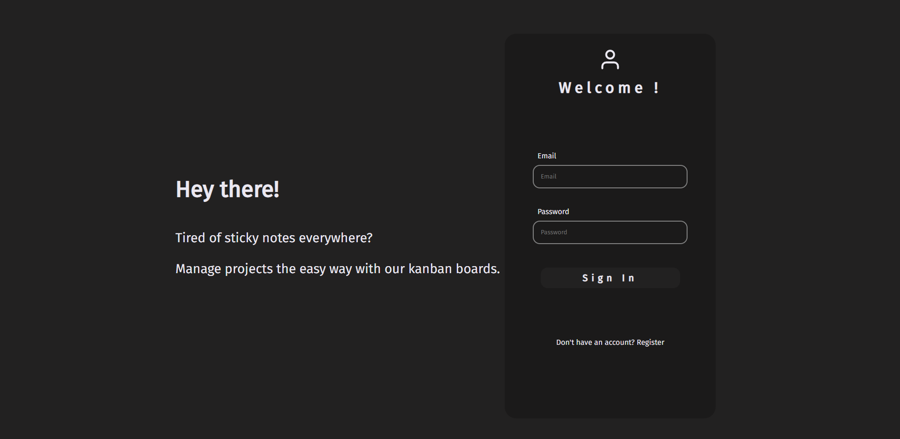

# Online Kanban Board

## Description

An online Kanban board application designed to help you manage your projects efficiently. This project includes features such as user registration and sign-in, project creation, card and task management, and drag-and-drop functionality for reordering tasks. Developed to enhance my skills in React and full-stack development, this app has provided valuable insights and experiences.

## Features

- User registration and sign-in
- Create and manage projects
- Create, update, and delete cards
- Add and manage tasks within cards
- Drag-and-drop functionality to reorder or move tasks between cards

## Tech Stack

### Frontend


### Backend


### Database


### Development Tools


## Screenshots




## Installation

### Prerequisites

- Node.js
- npm or yarn
- [MongoDB Atlas account and cluster](https://www.mongodb.com/cloud/atlas/register)

### Steps

1. Clone the repository:
   ```bash
   git clone https://github.com/RusithHansana/online-kanban-application.git
   ```

2. Navigate to the project directory:
   ```bash
   cd online-kanban-application
   ```

3. Install frontend dependencies:
   ```bash
   cd frontend
   npm install  # or yarn install
   ```

4. Install backend dependencies:
   ```bash
   cd ../backend
   npm install  # or yarn install
   ```

5. Create a `.env` file in the server directory and add the following variables:
   ```env
   NODE_env = development
   PORT=5000
   USER = mongodb atlas username
   password = mongodb atlas password
   MONGO_URI=your_mongodb_connection_string
   JWT_SECRET=your_jwt_secret
   ```

6. Start the development server:
   ```bash
   npm run dev  # This will concurrently start both frontend and backend servers
   ```

## Usage

1. Open your browser and go to `http://localhost:3000` to use the Kanban board application.
2. Register a new user account or sign in with your credentials.
3. Start creating projects, adding cards, and managing tasks!

## Contributing

If you would like to contribute, please fork the repository and use a feature branch. Pull requests are warmly welcome.

1. Fork the repository
2. Create your feature branch (`git checkout -b feature/AmazingFeature`)
3. Commit your changes (`git commit -m 'Add some AmazingFeature'`)
4. Push to the branch (`git push origin feature/AmazingFeature`)
5. Create a new Pull Request

## Acknowledgments

- [React](https://reactjs.org/)
- [Redux Toolkit](https://redux-toolkit.js.org/)
- [Framer Motion](https://www.framer.com/motion/)
- [React Beautiful DnD](https://github.com/atlassian/react-beautiful-dnd)
- [Express](https://expressjs.com/)
- [Mongoose](https://mongoosejs.com/)

## Feedback

Feel free to provide feedback and suggestions for improvements. If you encounter any issues or have ideas for optimizations, please let me know!
